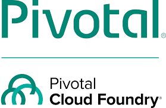

### Hi I am dipendra 👋

I am a software engineer(Microservices developer & Cloud Practitioner) with  nearly 5 years of experience building distributed systems and products. 
I currently works as a senior consultant technology.In my current job, 
I focuses on building platforms based on JVM (Java) and cloud technologies. I enjoys learning new technologies. 
I am also interested in coaching,mentoring small teams that build scalable software solutions.

